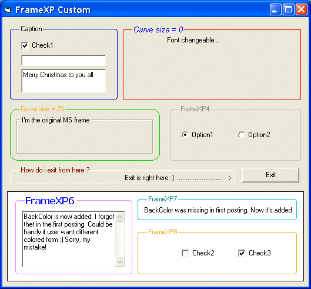



## XP Style Frame \(JCSR\) as Usercontrol

### Description

I got the idea when i sow Juan Carlos San Rom&#225;n's excellent posting (txtCodeId=63739&amp;lngWId=1) Read top of usercontrol. I've changed/added a little to make it work as usercontrol. Propertys are: Caption, Font, CaptionColor, BorderColor and sizable curved corners. Thanks Juan, MS Frame is history to me :) Hope you all like it. Thanks! BackColor
 
### More Info
 

             |
---                |---
**Submitted On**   |2005-12-24 15:21:30
**By**             |[Jim K](https://github.com/Planet-Source-Code/PSCIndex/blob/master/ByAuthor/jim-k.md)
**Level**          |Intermediate
**User Rating**    |5.0 (45 globes from 9 users)
**Compatibility**  |VB 5\.0, VB 6\.0
**Category**       |[Custom Controls/ Forms/  Menus](https://github.com/Planet-Source-Code/PSCIndex/blob/master/ByCategory/custom-controls-forms-menus__1-4.md)
**World**          |[Visual Basic](https://github.com/Planet-Source-Code/PSCIndex/blob/master/ByWorld/visual-basic.md)
**Archive File**   |[XP\_Style\_F19596312242005\.zip](https://github.com/Planet-Source-Code/jim-k-xp-style-frame-jcsr-as-usercontrol__1-63762/archive/master.zip)

